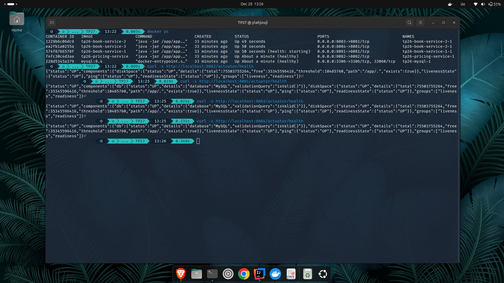
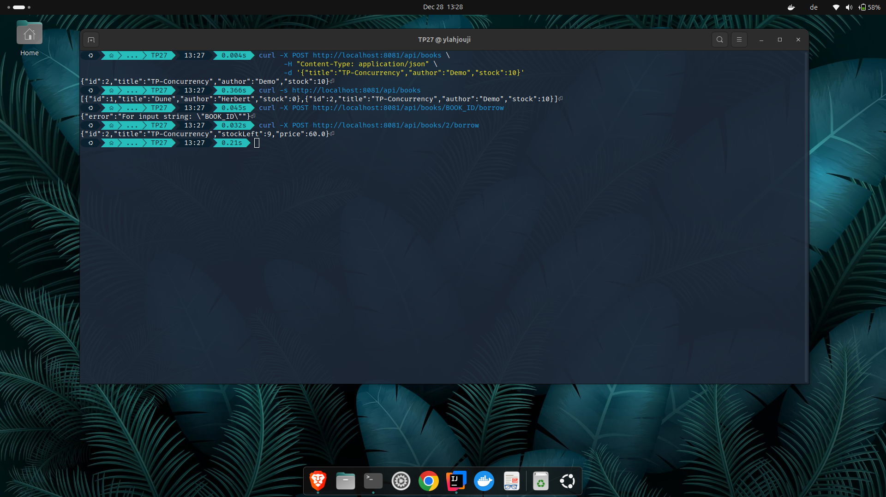
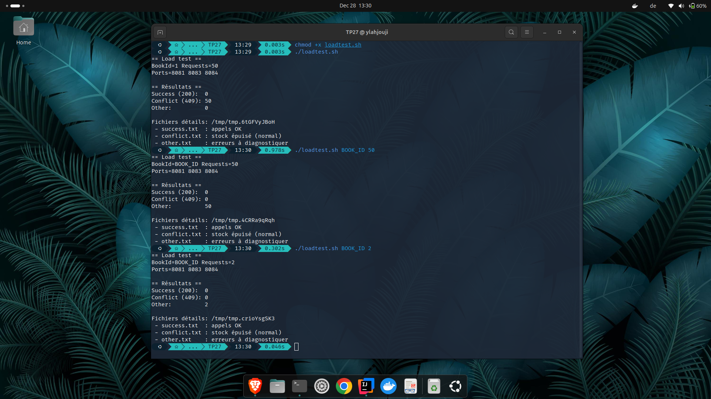
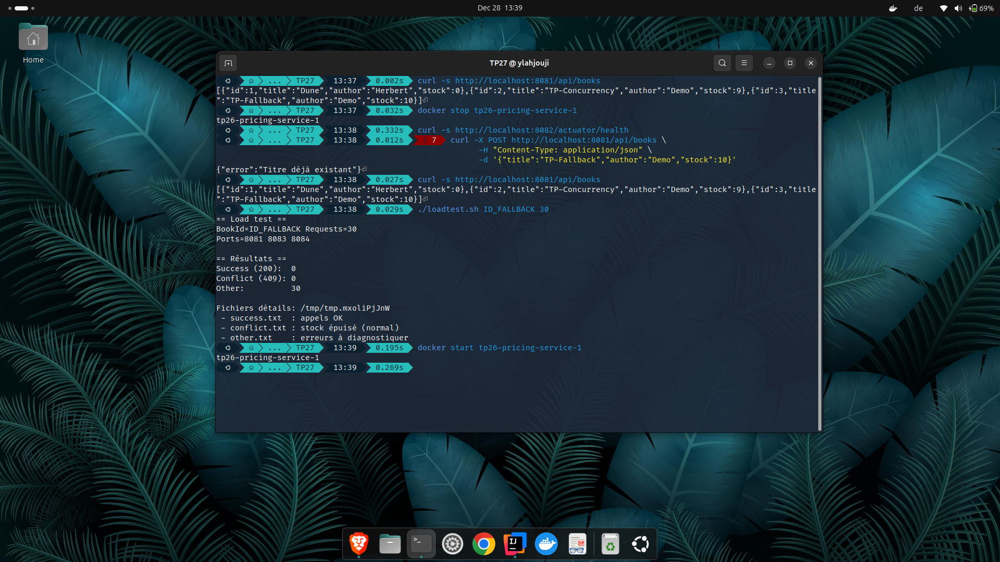
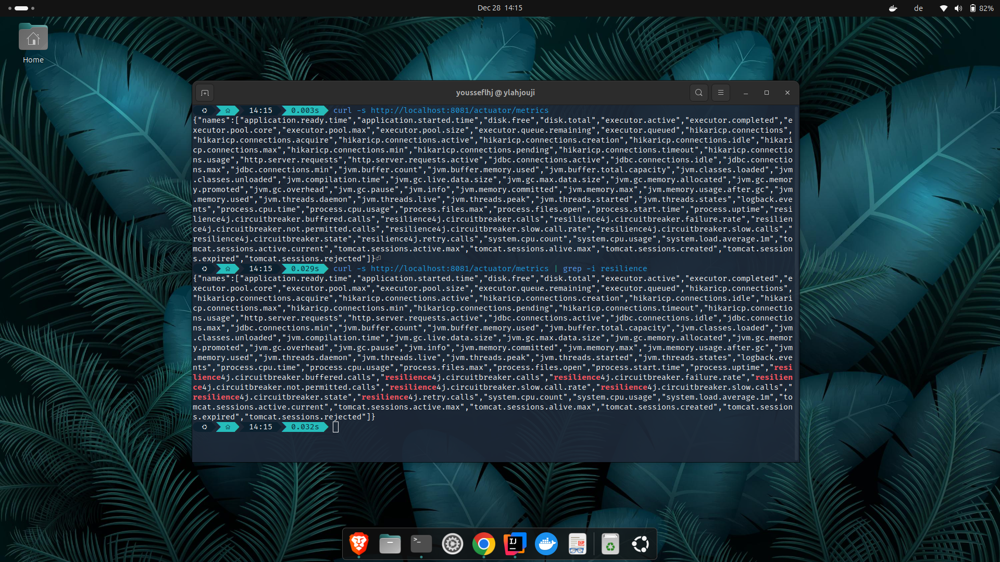

## 1. Supervision des microservices Docker – État de santé opérationnel

## 2. Test des endpoints REST – Création et emprunt de livres via API

## 3. Test de charge concurrente – Gestion des conflits et épuisement du stock

## 4. Mise en œuvre du fallback et tests de résilience sous charge

## 5. Visualisation des métriques applicatives via Spring Boot Actuator

## 6. Conclusion

### Verrou base de données en multi-instances

Dans une architecture multi-instances, plusieurs instances d’un même service accèdent simultanément à la même base de données. Sans verrou au niveau de la base, deux instances peuvent lire et modifier la même donnée en parallèle, ce qui provoque des incohérences métier (par exemple un stock négatif). Les verrous applicatifs ne suffisent pas car ils sont limités à une seule instance. Le verrou côté base de données garantit qu’une seule transaction peut modifier une ressource critique à la fois, assurant ainsi la cohérence des données sous charge.

---

### Rôle du circuit breaker

Le circuit breaker protège le système contre les défaillances en chaîne. Lorsqu’un service dépendant devient lent ou indisponible, le circuit breaker détecte un taux d’erreurs élevé et bloque temporairement les appels vers ce service. Cela évite la saturation des ressources, limite la propagation des pannes et stabilise l’ensemble du système.

---

### Rôle du fallback

Le fallback fournit une réponse contrôlée lorsqu’une erreur survient ou lorsque le circuit breaker est ouvert. Au lieu de laisser une exception ou un timeout se propager, le système renvoie une réponse prévisible et maîtrisée, ce qui améliore la robustesse globale et l’expérience utilisateur, même en situation de dégradation.